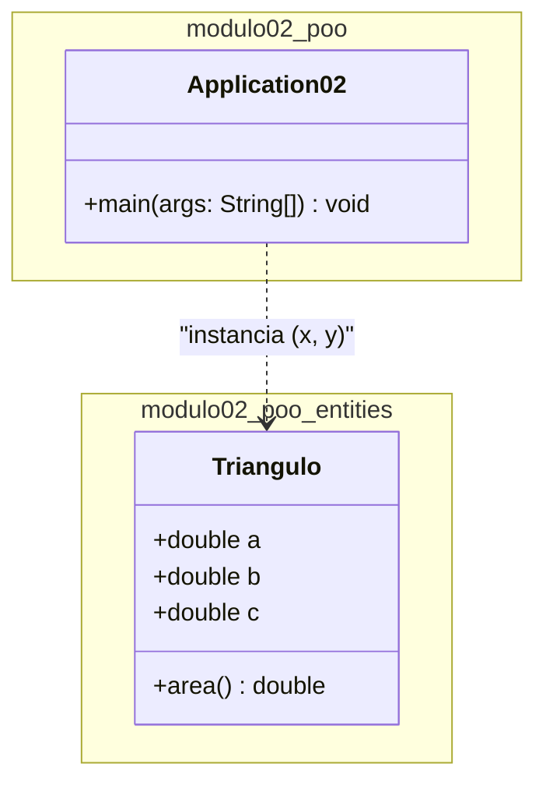

# Diagrama de Classe UML — Projeto Triângulo

Este documento apresenta a representação gráfica de exemplo do projeto em notação **UML (Unified Modeling Language)**, detalhando os atributos, métodos e relacionamentos entre a classe principal e a entidade.

---

## Diagrama UML (Mermaid)

## Legenda da Notação UML

### 1. Visibilidade dos Membros
* **`+` (Público / `public`)**: O atributo ou método pode ser acessado livremente por qualquer outra classe.

---

### 2. Estrutura da Classe `Triangulo`

| Elemento | Sintaxe UML | Descrição no Java |
| :--- | :--- | :--- |
| **Atributos** | `+a: double` `+b: double` `+c: double` | Campos `public double a, b, c;` do triângulo. |
| **Métodos** | `+area() : double` | Método `public double area()` que retorna a área em `double`. |

---

### 3. Relacionamento
* **Seta Tracejada (`..>`)**: Representa uma **Dependência** (uso temporário). Indica que a classe `Application02` utiliza a classe `Triangulo` para instanciar os objetos `x` e `y` e executar a lógica do programa.